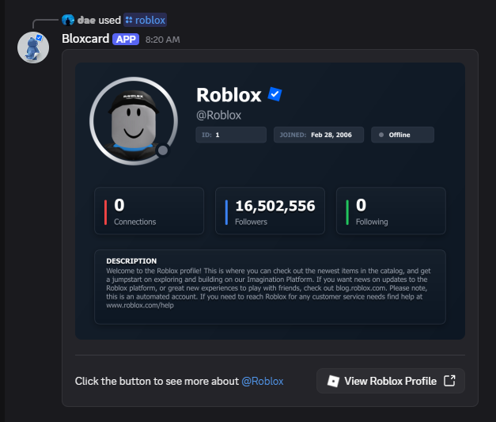
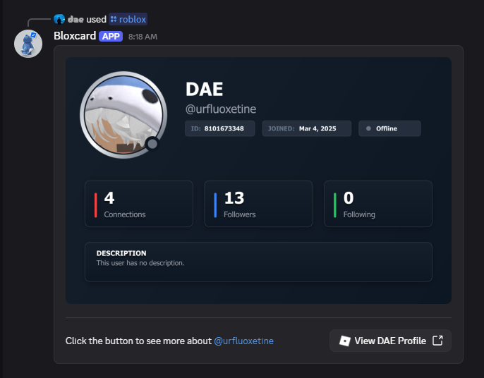

# Cardblox

> **Built for Discord Buildathon 2025** 🏆

**Cardblox** is a powerful Discord bot designed to bridge the gap between Discord and Roblox. It fetches detailed Roblox user information and transforms it into sleek, aesthetically pleasing profile cards directly within your Discord channels.

## ✨ Features

- **Roblox Profile Cards**: Instantly generate beautiful cards displaying a user's avatar, stats, and status.
- **Sleek Aesthetics**: Designed with a modern, premium look to "OK? yeah, OK! wow." users.

## 🛠️ Tech Stack

- **Runtime**: Node.js (v24.12.0)
- **Library**: Discord.js (v14.25.1)
- **License**: MIT

## Preview

<p align="center">
  
  
</p>

## Getting Started

Follow these steps to get your own app running.

### Prerequisites

- Node.js v24.12.0 or higher
- A Discord Bot Application (Token & Client ID)

### Installation

1. **Clone the repository**
   ```bash
   git clone https://github.com/3-14-denies-Phi/ddev-roblox-card
   cd ddev-roblox-card
   ```

2. **Install dependencies**
   ```bash
   npm install
   ```

3. **Configuration**
   Rename the `.env.example` file to `.env` and fill in your credentials:
   ```env
   DOTENV_CONFIG_QUIET=true_or_false
   TOKEN=your_discord_app_token
   CLIENT_ID=your_discord_app_id
   ```

4. **Start the Bot**
   ```bash
   npm run start
   ```

## 📜 License

This project is licensed under the [MIT License](LICENSE).